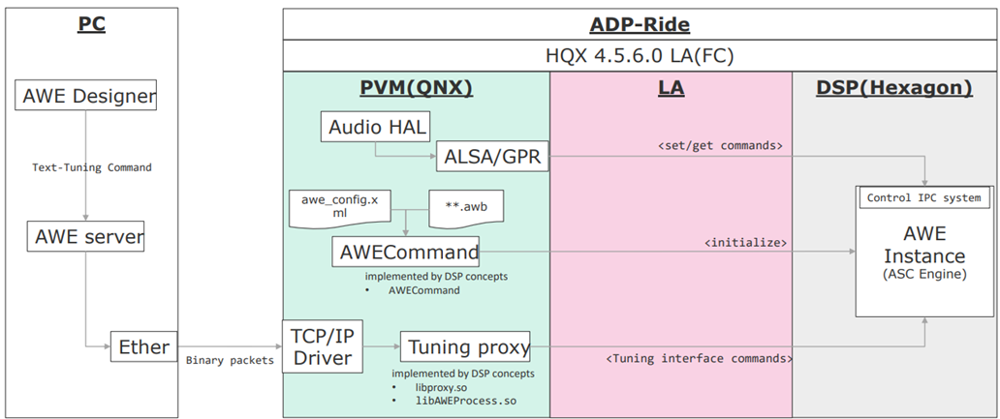

# ソフトウェアシステム設計書

## 改訂履歴
| 改訂日 | 版数 | 変更内容 | 担当 | 工程チケットID |
|-|-|-|-|-|
| 2025/5/21 | v1.0 | 初版作成 | DTEN後藤 | [BEVIVIPRC-17365BEVIVIPRC-17365](https://jira.geniie.net/browse/BEVIVIPRC-17370)

## 目次
1. [機能概要・変更点](#1-機能概要変更点)
1. [WT図](#2-wt図)
1. [ソフトウェア構成図](#3-ソフトウェア構成図)
1. [シーケンス図](#4-シーケンス図)
1. [インターフェース仕様](#5-インターフェース仕様)

## 1. 機能概要・変更点

### 1-1. 機能概要
#### 目的
ASC機能における ASC Engine で生成される走行サウンドを外部からチューニングする機能について、システム構成を定義する。

#### 適用範囲
| | |
|---|---|
| 機種 | BEV Step3 CDC |
| 仕向け | 全仕向け Debug版ソフトのみ | 
| マイルストーン | CV |
| 機能分類 | ASC HAL |

#### 用語説明
|||
|-|-|
| ASC (Active Sound Control) | 車速、アクセル開度、トルク等車両の走行状態に応じて音源データの音量ピッチを変更し、車載スピーカーから再生することで心地よい走行サウンドを提供する機能。|
|ASC Engine | 走行サウンドを生成する Engine。24MMでは外部ECUが搭載されていたが、BEV Step3 CDC では内部モジュールとして DSP上に搭載される。

#### 関連資料

#### ターゲット
- Qualcomm SA8255P
- x86-64

### 1-2. 母体
DSP Concept(以後 DSPC と呼称) 提供のチューニングツールを母体とする。

### 1-3. 変化点およびソフト変更概要、設計方針
#### 変化点
QNX および LV に開放されていた USB port が LV のみの開放へ変更。これにより、Host PC との通信は LV 側からのみとなる。

#### ソフト変更内容
以上の変更点に加え、ASC Engine の制御を QNX 上から実施しなければならないという制約により、

 1. PC port からの通信を LV で受ける
 2. LV で受けたコマンドを QNX へ bridge する

を満たすように、ソフトを構成する。

#### 設計方針
DTPC 提供のチューニングツールを基に、PC ⇔ LV ⇔ QNX ⇔ ASC Engine とコマンドを送受信するためのソフトウェア構成を定義する。また、LV ⇔ QNX 間の通信ついては QCD などの観点から `socat`という OSS を活用する。

### 1-4. 異常検知時のリカバリ方針
以下のアーキ方針に則る

[204.01.01. 230915_Tie1内Service異常終了時の方針](https://wiki.geniie.net/pages/viewpage.action?pageId=1115850958)

## 2. WT図

## 3. ソフトウェア構成図

## 4. シーケンス図

## 5. インターフェース仕様
